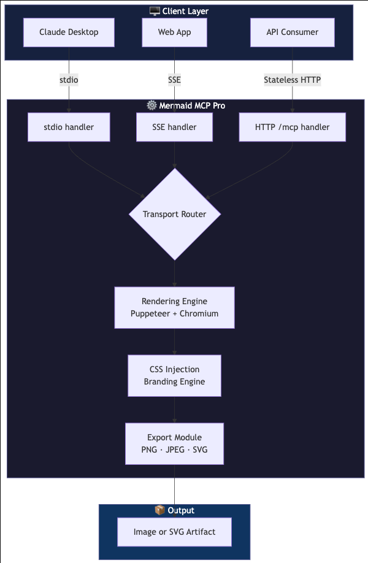

# 🧜‍♂️ Mermaid MCP Pro
### The Enterprise-Grade Visual Context Layer for Model Context Protocol

[](#)
[](https://opensource.org/licenses/Apache-2.0)
[](https://modelcontextprotocol.io)
[](https://www.docker.com/)

**Mermaid MCP Pro** is a high-performance Model Context Protocol (MCP) server designed to bridge the gap between LLM reasoning and professional visual documentation. It enables AI models to generate, style, and render complex diagrams directly within the chat interface or as part of a distributed cloud architecture.

Unlike standard renderers, this server features a **Dual-Transport Engine**, allowing seamless switching between local development and scalable production environments.

---

## ⚡ Key Value Propositions

* **🌐 Universal Transport Architecture**: Native support for `stdio` (local desktop clients like Claude), `SSE` (Server-Sent Events) for persistent web connections, and **Stateless HTTP** (`/mcp`) for serverless/cloud-native deployments.
* **🎨 Corporate Branding Engine**: Go beyond default themes. Inject **Custom CSS**, corporate color palettes, and brand-compliant typography directly into the rendering pipeline.
* **🐳 Infrastructure-Agnostic**: A fully containerized Chromium-based rendering engine (via Puppeteer). No local `mermaid-cli` or Node.js dependencies required on the host machine.
* **🛠 Production Ready**: Built-in support for watermarking, custom logos, and dynamic resolution scaling for high-fidelity exports (PNG, SVG, PDF).

---

## 🚀 Architectural Overview

The server operates as a sophisticated bridge between the LLM's text output and a headless rendering context:

$$\text{LLM (Mermaid Syntax)} \xrightarrow{\text{MCP Tool Call}} \text{Server (Puppeteer)} \xrightarrow{\text{CSS Injection}} \text{Image Artifact}$$

### Features at a Glance:
| Feature | Description |
| :--- | :--- |
| **Dynamic Rendering** | Real-time conversion of Mermaid strings to visual assets. |
| **Dual-Mode** | Toggle between `stdio` for privacy and `HTTP/SSE` for scalability. |
| **Theming** | Support for `dark`, `default`, `forest`, `neutral`, and `base`. |
| **Branding** | Automated injection of logos and watermarks for internal docs. |
| **Zero-Config** | Pre-configured Docker images for instant deployment. |

### 🖼️ Real-World Rendering Example

This diagram was generated in real-time by the **Mermaid MCP Pro Server**. It showcases the potential of custom theme application and the high-fidelity output.

<p align="center">
  
</p>

* The example above uses the **'base'** theme with custom corporate color variables injected during the render pipeline.

---

## 🛠 Tool: `generate_diagram`

This server exposes a single, powerful tool to generate diagrams.

### Arguments

| Argument     | Type     | Default     | Description |
|--------------|----------|-------------| --- |
| `definition` | `string` | *Required*  | Raw Mermaid syntax (e.g., `graph TD; A-->B`). No markdown blocks. |
| `format`     | `enum`   | `"png"`     | Output format: `png`, `jpg`, or `svg`. |
| `theme`      | `enum`   | `"default"` | Visual theme: `default`, `dark`, `forest`, or `neutral`. |
| `width`      | `number` | `800`       | Image width in pixels (applies to PNG/JPG). |
| `css`        | `string` | `empty`     | Optional raw CSS to inject into the diagram. Use it to override fonts, colors, or element styles (e.g., `rect { fill: red; }`). |

---

## ⚙️ Configuration

The server behavior is controlled via environment variables.

| Variable | Description | Default |
| --- | --- | --- |
| `PORT` | The port the server listens on. | `3000` |
| `MCP_TRANSPORT` | The transport layer to use (`sse` or `stdio`). | `stdio` |
| `LOGO_URL` | Public URL of a logo image to embed in the bottom-right corner of every diagram. | *(disabled)* |
| `WATERMARK` | Text to render as a diagonal watermark across the center of every diagram. | *(disabled)* |

> **Note:** Even if `MCP_TRANSPORT` is set to `sse`, the stateless `/mcp` endpoint remains active for direct HTTP POST requests.

---

## 🖼 Branding: Logo & Watermark

You can brand every generated diagram by setting one or both of the following environment variables. Both features are **opt-in** — if the variable is not set or is empty, nothing is added.

### `LOGO_URL`

Set this to the public URL of any PNG, JPG, or SVG image. It will be in the **bottom-right corner** of every diagram at 60% opacity.

```bash
LOGO_URL=https://example.com/your-logo.png
```

### `WATERMARK`

Set this to any text string. It will be rendered diagonally across the **center** of every diagram in a large, semi-transparent grey font.

```bash
WATERMARK="© My Company"
```

### Combined Example (Docker)

```bash
docker run -d \
  -p 3000:3000 \
  -e PORT=3000 \
  -e MCP_TRANSPORT=sse \
  -e LOGO_URL=https://example.com/logo.png \
  -e WATERMARK="Internal Use Only" \
  --name mermaid-server \
  mermaid-mcp
```

### Combined Example (Docker Compose)

```yaml
services:
  mermaid-mcp:
    build: .
    ports:
      - "3000:3000"
    environment:
      - PORT=3000
      - MCP_TRANSPORT=sse
      - LOGO_URL=https://example.com/logo.png
      - WATERMARK=Internal Use Only
    restart: always
```

> **Tip:** If `LOGO_URL` is unreachable, the server logs a warning and continues normally — logo embedding is skipped gracefully without blocking diagram generation.

---

## 📦 How to Run

### 1. Locally (Node.js)

To run the server directly on your machine:

```bash
# Set variables and start the server
PORT=3000 MCP_TRANSPORT=sse npm start
```

With branding:

```bash
PORT=3000 MCP_TRANSPORT=sse LOGO_URL=https://example.com/logo.png WATERMARK="Draft" npm start
```

### 2. Using Docker (CLI)

Inject environment variables using the `-e` flag:

```bash
# Build the image
docker build -t mermaid-mcp .

# Run the container
docker run -d \
  -p 3000:3000 \
  -e PORT=3000 \
  -e MCP_TRANSPORT=sse \
  --name mermaid-server \
  mermaid-mcp
```

### 3. Using Docker Compose

Add this to your `docker-compose.yml`:

```yaml
services:
  mermaid-mcp:
    build: .
    ports:
      - "3000:3000"
    environment:
      - PORT=3000
      - MCP_TRANSPORT=sse
    restart: always
```

### 4. Test with Inspector

```bash
npm run build && npx @modelcontextprotocol/inspector node dist/index.js
```

---

## 🔌 API & Connectivity

Mermaid MCP Pro is designed for maximum flexibility. It exposes a versatile interface that adapts to your infrastructure—whether it's a local CLI or a cloud-scale cluster.

| Endpoint | Method | Description                                                            | Protocol |
| :--- | :--- |:-----------------------------------------------------------------------| :--- |
| `/sse` | `GET` | **Handshake**: Initializes the persistent EventSource stream.          | MCP (SSE) |
| `/messages` | `POST` | **Command Bridge**: Sends JSON-RPC payloads to an active session.      | MCP (SSE) |
| `/mcp` | `POST` | **Stateless Gateway**: Single-request execution. Ideal for serverless. | HTTP |
| `/health` | `GET` | **Liveness Probe**: Returns `200 OK` if the engine is ready.           | HTTP |

---

### 🧠 Implementation Notes

#### Stateless HTTP Mode (`/mcp`)
This endpoint allows for high-concurrency rendering without the overhead of session management. Perfect for:
* **CI/CD Pipelines**: Automate diagram generation in your docs.
* **Webhook Integrations**: Trigger renders from external events.

#### Health Checks & Reliability
The `/health` endpoint doesn't just check the server; it verifies the **Chromium Rendering Engine** status.
* Use this in your `docker-compose.yml` or K8s `livenessProbe` to ensure zero-downtime rendering.

## 📝 Example Request (Stateless)

If you want to test the server without an MCP client, you can use `curl`:

```bash
curl -X POST http://localhost:3000/mcp \
-H "Content-Type: application/json" \
-d '{
  "jsonrpc": "2.0",
  "id": 1,
  "method": "tools/call",
  "params": {
    "name": "generate_diagram",
    "arguments": {
      "definition": "graph TD; Start --> Stop",
      "format": "png",
      "theme": "dark"
    }
  }
}'
```

---
